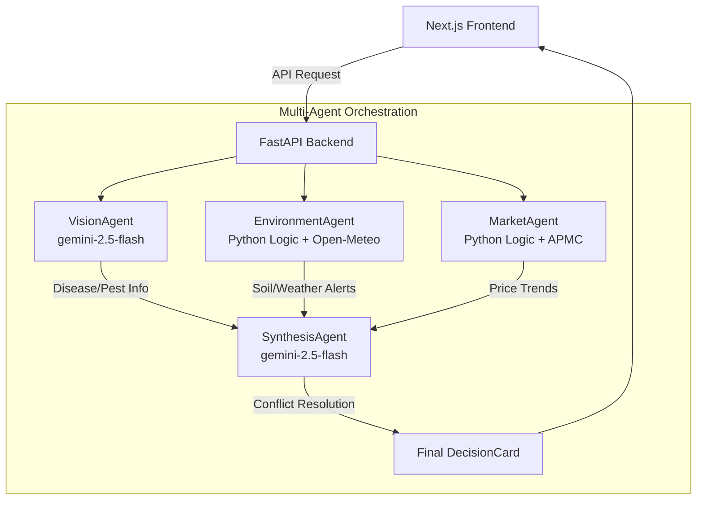

<<<<<<< HEAD
# AI Smart Agriculture Decision Agent

The AI Smart Agriculture Decision Agent is a multi-agent backend and Next.js frontend dashboard designed to resolve conflicting agricultural decisions for smallholder farmers. 

By employing multiple specialized LLM agents (Vision, Environment, Market) and a Synthesis Agent to orchestrate them, the system generates real-time, holistic farming advice.

## Multi-Agent Architecture



## Demo Presets

The UI includes a "Judge Demo Preset" dropdown to instantly simulate complex agricultural scenarios:

| Preset Scenario | Agent Conflict | Synthesis Resolution |
| :--- | :--- | :--- |
| **Tomato Early Blight + Storm** | Vision detects blight (requires spray), but Environment detects imminent 25mm rain (washes away spray). | **DELAY SPRAY**: Avoids wasting chemical costs. Wait until storm passes. |
| **Wheat Drought + Delayed Rain** | Environment detects 15% soil moisture and no rain in the 5-day forecast. | **IRRIGATION**: Prioritize water immediately to prevent crop loss. |
| **Maize Harvest Surge** | Market detects peak commodity prices for mature maize. | **HARVEST**: Overrides routine monitoring to secure best market rates. |

## How to Run Locally

### 1. Backend (FastAPI)
The backend includes a `USE_MOCK_DATA=true` flag by default, allowing you to run the presets offline without hitting the Gemini API or Open-Meteo API.

```bash
cd backend
python -m venv venv
.\venv\Scripts\activate
pip install -r requirements.txt
cp .env.example .env
uvicorn app.main:app --reload
```
API runs on `http://127.0.0.1:8000`. Access Swagger UI at `http://127.0.0.1:8000/docs`.

### 2. Frontend (Next.js)
The frontend connects to the backend automatically.

```bash
cd frontend
npm install
npm run dev
```
Dashboard runs on `http://localhost:3000`.
=======
# ai-smart-agriculture-agent
>>>>>>> 52570734ce771249396fcec462ced9233e2ad451
